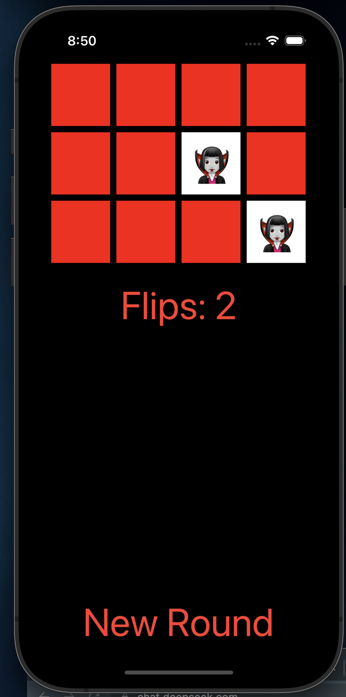
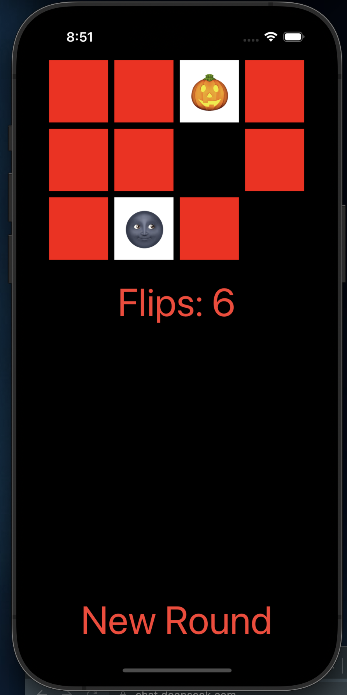

# Concentration

Concentration - приложение для игры в карточки, где необходимо найти

## Функционал 

<table>
  <tr>
    <td>
      
    </td>
    <td>
      
    </td>
    <td>
      
    </td>
  </tr>
</table>

**В приложении присутствуют 1 экран:**

На экране представлены карточки красного цвета, из которых нужно выбрать пары, Если пары совпадают при следующем нажатии карточки становятся черного цвета.

### Верстка 
- верстка приложения осуществляется с помощью UIKit
- ориентация: портретная

### Архитектурные паттерны

- приложение построено на реализации паттерна MVC

## Controller

- `ViewController` - основной класс, который является контроллером, и передает данные из view в model

## Model

- `Concentraton` - класс для model
- `Card` - класс для model

## View

- View реализовано с помощью storyBoards